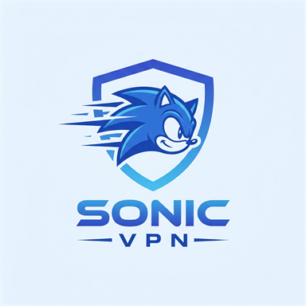

# ✦ Sonic VPN

<p align="center"></p>

<p align="center">Быстрый приватный VPN: VLESS Reality, серверы в Европе, оплата по **СБП** одним QR, 7 дней бесплатно, рефералка 20%.</p>

> Хостинг **за рубежом**, но **оплачивается из России** (МИР/СБП: AdminVPS Германия, Timeweb Франкфурт).
> Клиенты платят по **СБП QR** (ЮKassa, комиссия 0,4%). Инфраструктура — ~900–1 250 ₽/мес за 2 узла.

## Ключевые фишки (MVP, уже готово)
1. **Сайт работает в РФ без VPN** — Cloudflare (CDN + прокси, origin скрыт)
2. **Регистрация без подтверждения почты и номера** — логин + пароль; email опционален
3. **Оплата по СБП QR** — ЮKassa (`sbp` + карты РФ); тестовый режим `PAYMENT_MODE=mock`
4. **Три тарифа** — 1 мес 199 ₽ / 3 мес 499 ₽ / 12 мес 1 499 ₽ (+ 7 дней пробного)
5. **Реферальная программа 20%** — со всех оплат (вкл. продления); балансом можно платить
6. **Telegram**: канал, бот (покупка/QR/статистика), **поддержка с нейронкой** (OpenAI-совместимый API, FAQ-фолбэк)
7. **Статистика рефералов** — email, TG, дата подключения, активность, оплаты, заработок 20%
8. **Синхронизация аккаунта с TG** — Login Widget на сайте + `/start`, `/link` в боте
9. **Устройства**: 2 в подписке (свой QR на каждое), докупка +1 за 99 ₽ (до 10), пользователь сам блокирует/включает/удаляет устройства (кабинет, `/block` `/unblock` в боте)

## Структура
```
public/           — сайт (лендинг, вход/регистрация, кабинет, чекаут) — без сборки
  img/logo.png    — логотип (поменять файл = поменял бренд в шапке, футере, favicon)
server/           — Node.js 22 / Express + встроенный node:sqlite + Grammy (бот)
  src/routes/     — auth, pay (ЮKassa + mock), account (подписка, рефералка), webhooks
  src/vpn/        — провайдеры: mock (демо VLESS+Reality) и 3x-ui (реальный VPS)
  src/bot.js      — TG-бот: меню, покупка СБП, QR-профиль, рефералка, AI-поддержка
  src/ai.js       — нейросетевая поддержка (KB + OpenAI-совместимый API / FAQ-фолбэк)
  src/cron.js     — напоминания об окончании подписки (5/2/1 день: TG + email)
deploy/           — деплой: README.md (пошагово, оплата из РФ) + vps-setup.sh
docs/             — ANALYSIS.md (24hype + конкуренты), PLAN.md (концепция, риски)
data/             — SQLite-база (создаётся автоматически, в .gitignore)
```

## Запуск локально (тестовый режим)
```bash
cd server
npm install
cp .env.example .env        # PAYMENT_MODE=mock — кнопка «Я оплатил» работает сразу
npm start                   # http://localhost:8080
```
Поток: регистрация → 7 дней пробника → QR-профиль (демо VLESS+Reality) → оплата (mock) → подписка + 20% рефереру.

## Боевой запуск
Подробно: [`deploy/README.md`](deploy/README.md). Кратко:
1. **VPS**: AdminVPS Германия или Timeweb Франкфурт (2 vCPU/4 GB, ~300–600 ₽/мес) — **оплата МИР/СБП**, автоплатёж по МИР. Второй узел — Нидерланды/Финляндия.
2. `bash deploy/vps-setup.sh` → 3x-ui + Caddy (авто-SSL) + firewall; в 3x-ui создать VLESS+Reality и Hysteria2.
3. **Домен** sonicvpn.ru (СБП у регистратора) → **Cloudflare** (A-запись, прокси ВКЛ).
4. **ЮKassa**: самозанятый («Мой налог») → Shop ID/Secret Key → `PAYMENT_MODE=yookassa` + webhook.
5. **BotFather**: `@sonicvpn_bot` (токен в `.env`), API URL для Login Widget = `https://sonicvpn.ru`; канал `@sonicvpn_channel`.
6. **AI-поддержка**: `AI_API_BASE/AI_API_KEY/AI_MODEL` (OpenRouter/Groq/OpenAI; без ключа — FAQ-режим).
7. Деплой: `git clone` → `npm install` → `.env` → `pm2 start`.

> 💡 **Альтернатива 0 ₽**: если есть зарубежная банковская карта — Oracle Cloud Always Free
> (4 ядра ARM / 24 GB / 10 ТБ трафика — бесплатно навсегда, ДЦ Frankfurt/Amsterdam).
> Российские карты Oracle не принимает — поэтому в основном плане AdminVPS/Timeweb.

## Риски
Честный разбор (юр. риски РФ, блокировки IP, 152-ФЗ, потолок самозанятого) — [`docs/PLAN.md` §7](docs/PLAN.md).
